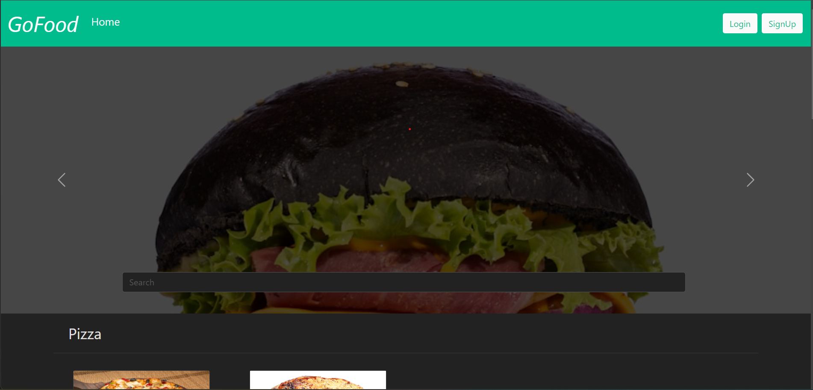
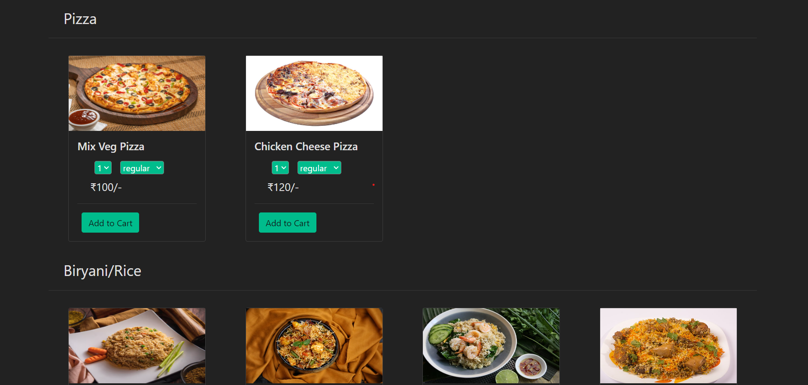
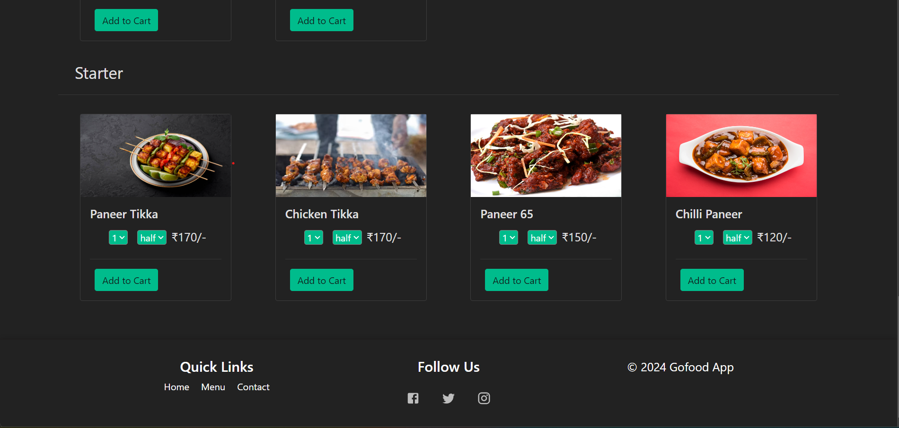
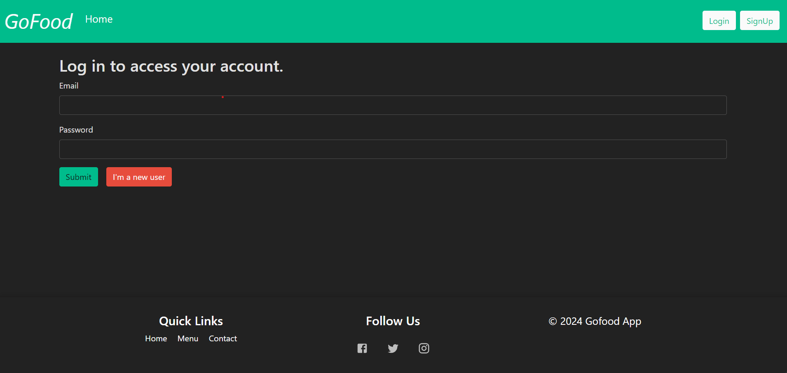
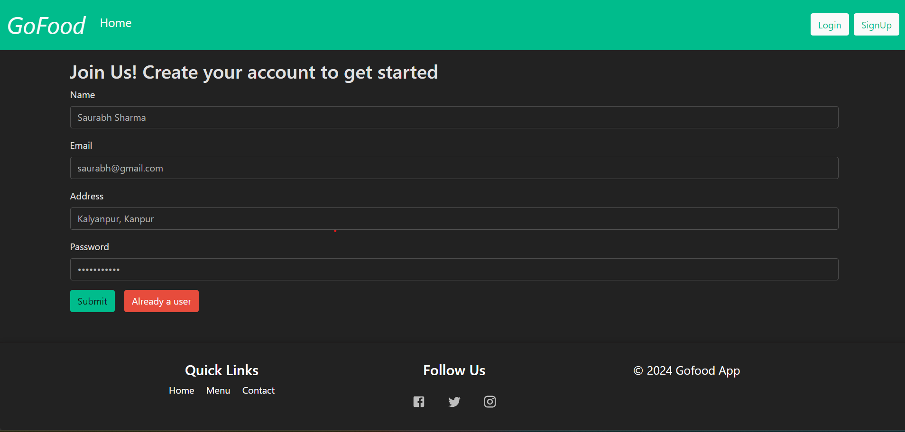
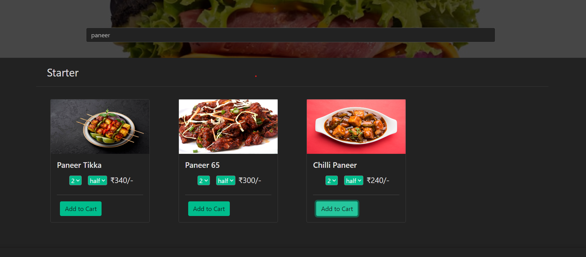
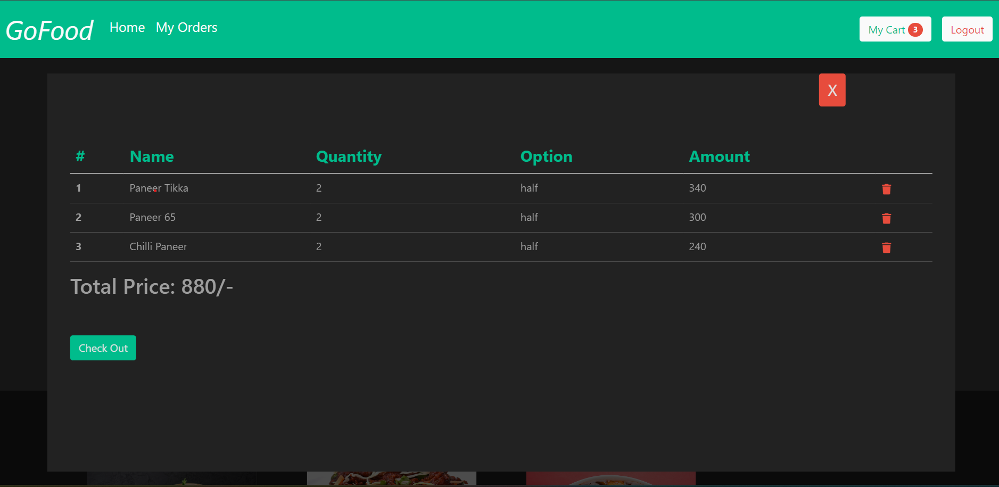
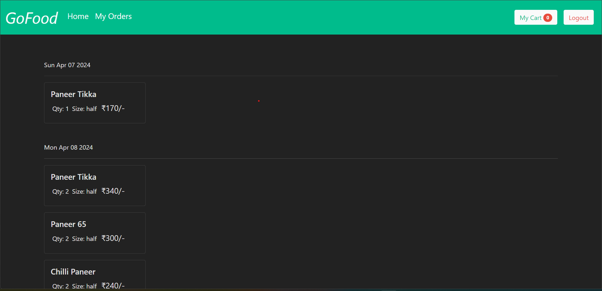

# GoFood App(MERN Stack Project)

Welcome to GoFood, GoFood is a full-stack web application that offers a delightful experience for browsing, ordering, and managing food items. With an intuitive user interface and robust backend, GoFood makes food ordering hassle-free and enjoyable.

## Project Live Demo

- Check out the live demo of the GoFood app [here](https://go-food-frontend-9etv.vercel.app/).

## Table of Contents

- [Features](#features)
- [Technologies Used](#technologies-used)
- [Screenshots](#screenshots)
- [Installation](#installation)
- [Usage](#usage)
- [Contributing](#contributing)
- [Validation](#validation)
- [Author](#author)
- [Deployment](#deployment)

## Features

- **User Authentication**: Secure user authentication and authorization system allow users to sign up, log in, and manage their accounts.
- **Browse Food Items**: Extensive collection of food items categorized by type, making it easy for users to discover new favorites.
- **Search Functionality**: Dynamic search bar enables users to quickly find specific food items by name or category.
- **Place Orders**: Seamless ordering process with options to customize orders and view order summaries before confirmation.
- **View Order History**: Detailed order history with timestamps and itemized lists for easy reference.

## Technologies Used

- **Frontend**: React.js, Bootstrap
- **Backend**: Node.js, Express.js, MongoDB
- **Database**: MongoDB Atlas
- **Authentication**: JSON Web Tokens (JWT), bcrypt
- **Styling**: Custom CSS, Bootstrap

## Screenshots

### Home Page



### Food Category


### Footer Page


### Login Page


### Signup Page


### Search Food


### Cart Section


### My Order


## Installation

To run the GoFood app locally, follow these steps:

1. Clone this GoFood_Frontend repository to your local machine.
   ```bash
   git clone https://github.com/Saurabh-Sharma-1999/GoFood_Frontend.git

### Navigate to the project directory.
```bash
  cd gofood-frontend
```
### Install dependencies.

```bash
  npm install
```


2. Clone this GoFood_Backend repository to your local machine.
   ```bash
   git clone https://github.com/Saurabh-Sharma-1999/GoFood_Backend.git

### Navigate to the project directory.
```bash
  cd gofood-backend
```
### Install dependencies.

```bash
  npm install
```

## Database Setup
- Sign up for MongoDB Atlas and create a new cluster.

- Create a ".env" file in the backend directory.

- Define the following variables in the ".env" file:

```bash
MONGO_URL=
JWT_SECRET=
```
## Usage

- Visit the home page to explore available food items and categories.
- Sign up or log in to place orders and view your order history.
- Use the search bar to find specific food items or categories.
- Customize your orders and proceed to checkout for a seamless ordering experience.

## Contributing
Contributions are welcome! If you'd like to contribute to the GoFood app, please follow these guidelines:

- Fork the repository and create your branch (git checkout -b feature/your-feature-name).
- Commit your changes (git commit -am 'Add new feature').
- Push to your branch (git push origin feature/your-feature-name).
- Create a new pull request.

## Validation

Validation is implemented in the backend for user input. The following validations are applied:

- Email Validation: Ensures that the provided email address is valid.
- Location Validation: Validates the user's location information.
- Name Validation: Requires the user's name to have a minimum length of 5 characters.
- Password Validation: Enforces a minimum length of 5 characters for the user's password.

## Author
Saurabh Sharma
- Email: saurabh7411sharma@gmail.com

## Deployment

### Backend Deployment

The backend of the GoFood app is deployed on Render. The server is hosted on Render's cloud infrastructure, providing reliability and scalability.

### Frontend Deployment

The frontend of the GoFood app is deployed on Vercel. Vercel's platform allows for seamless deployment of React applications with features like automatic CI/CD and instant scaling.

## Thank You!

Thank you for visiting the GoFood repository. We hope you enjoy using our app as much as we enjoyed building it. If you have any questions, feedback, or suggestions, feel free to reach out to us. Happy food ordering!
